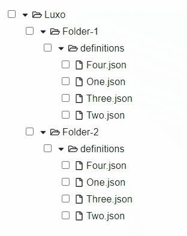
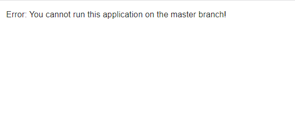

# JSON Schema Form editor

## Problem

Given a file structure like this:

```
.
├── SchemaForms
│   ├── Folder-1
│   │   └── definitions
│   │       ├── One.json
│   │       ├── Two.json
│   │       ├── Three.json
│   │       └── Four.json
│   └── Folder-2
│       └── definitions
│           ├── One.json
│           ├── Two.json
│           ├── Three.json
│           └── Four.json
```

and JSON structures like this:

```
{
    "stuff": "stuff",
    "label": {
        "stuff": "stuff",
        "control": [
            "KEY:ONE",
            "KEY:TWO",
            "KEY:THREE",
            "KEY:FOUR"
        ]
    }
}
```

Create a function that allows editing of the values within the JSON or multiple JSON files.

## Requirements

- [x] List all folders as a menu with some way to select one, many or all of the folders
- [x] List all the json files in the selected folder(s) as a menu with some way to select one, many or all of the files

_I've combined this with the first requirement, in the form of a tree structure component._


- [x] Accept string input of one or many words to add i.e. "NINE" or "WORD" and have an add button.

_I've also allowed for the KEY to be edited._

- [x] When add button is pressed format the given word in the format "KEY:WORD", then check selected JSON files. If label.control doesn't contain the key/value then add it, else ignore.

_Here is a GIF of the application processing some files._


## Nice to have

- [x] Check current branch is good - "You are on branch {branch name} do you wish to continue?"
- [x] Don't allow to run on master

_Also not allowed to be run on main or production. Application replaced with error message:_


- [x] Show list of changes

_Displaying messages in a readonly output textarea._

- [x] Commit changes with meaningful commit message

_Example message:_

```
KEY:WORD was appended to each of the following JSON Schema Forms:
     SchemaForms/Folder-1/definitions/Four.json,
     SchemaForms/Folder-2/definitions/One.json,
     SchemaForms/Folder-2/definitions/Two.json.
```

## Running the application

These instructions assume that you're running the application from a Linux terminal. Make sure node is installed first, then setup the project:

```
cd json-form-editor;
npm install;
```

Run the server-side in a tab with the command:

```
npm run server
```

Then run the client-side in a different tab with the command:

```
npm start
```

**NB: It's important to start the server before you start the client.**
